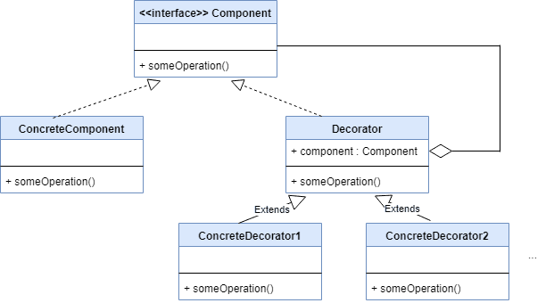

# 🎁 Decorator Pattern in Java

## Why Do We Need the Decorator Pattern?

The **Decorator Pattern** is used when you want to **add new behavior or responsibilities to an object** without modifying its structure. It allows you to **wrap** an object with new functionality in a flexible, reusable way.

---

## 🧠 Real-World Analogy

> You have a basic coffee ☕. Then you can *wrap* it with a decorator that adds milk 🥛, sugar 🍬, or whipped cream 🍦.  
Each decorator adds a new feature — without changing the original coffee.

---

## 🚫 Without Decorator Pattern

Without it, you'd end up creating lots of subclasses like (class explosion):

- `PlainCoffee`
- `CoffeeWithMilk`
- `CoffeeWithSugar`
- `CoffeeWithMilkAndSugarAndWhippedCream`

This gets messy and unmaintainable.

---

## ✅ With the Decorator Pattern

You can dynamically compose features at runtime:

```java
Beverage coffee = new PlainCoffee();
coffee = new MilkDecorator(coffee);
coffee = new SugarDecorator(coffee);
coffee = new WhippedCreamDecorator(coffee);

System.out.println(coffee.getDescription());

```
## Key Benefits

- Adds behavior without modifying the original class
- Follows the Open/Closed Principle (SOLID)
- Easily extendable and composable
- Avoids a complex inheritance hierarchy
- Flexible at runtime — stack features dynamically

## 💡 When to Use the Decorator Pattern

- When you need to add behavior to individual objects, not the whole class
- When subclassing would explode into too many combinations
- When you want to follow composition over inheritance
- When you want to keep your code clean and loosely coupled


## 💡 UML Diagram




